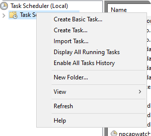
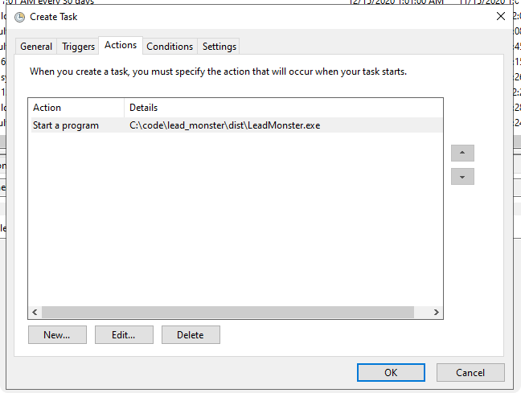
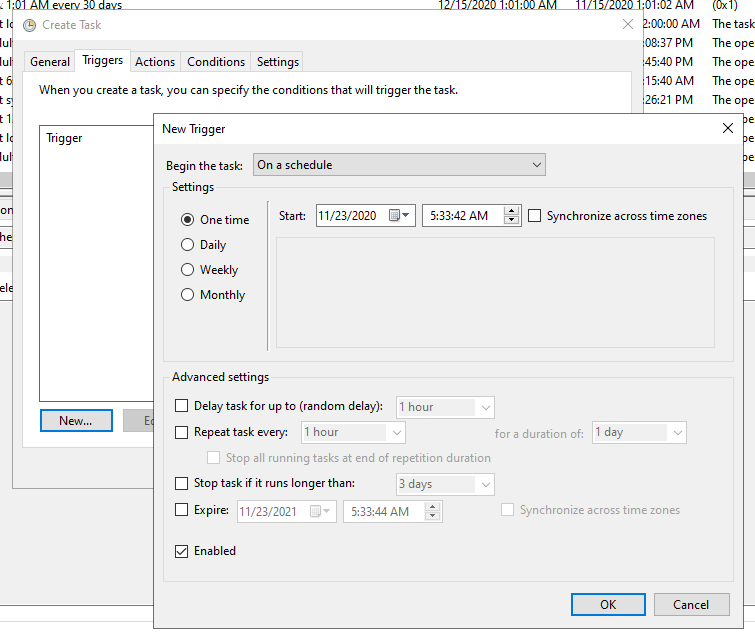
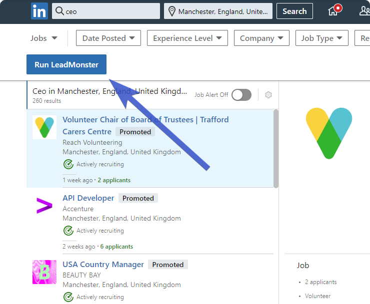

# LeadMonster

### Instructions
1. Open LeadMonster.exe

2. Enter search keyword + location.

3. Enter number of jobs to scrape.

4. Log in (once) to any Sales Navigator account.

5. Fine-tune the search as needed, then click "Run LeadMonster" to begin the process.

### Blacklist companies
Enter company names in `blacklist.txt` to exclude companies.

### Automatic mode
In `config.txt`, enable automatic with `auto_mode = True`. LeadMonster will now use the `auto.csv` file.

### How to schedule on Windows
Make sure automatic mode is enabled, as shown above. Go to `Task Scheduler`, right click on `Task Scheduler Library` and click `New Task`. 

Under `Actions` select the .exe location:

Select your desired schedule under `Triggers`:

### Settings
`max_leads_per_company`

The maximum number of leads per company.

`max_random_delay`

A random delay (in seconds) between page to page. This is optional but can be useful for longer scrapes.

